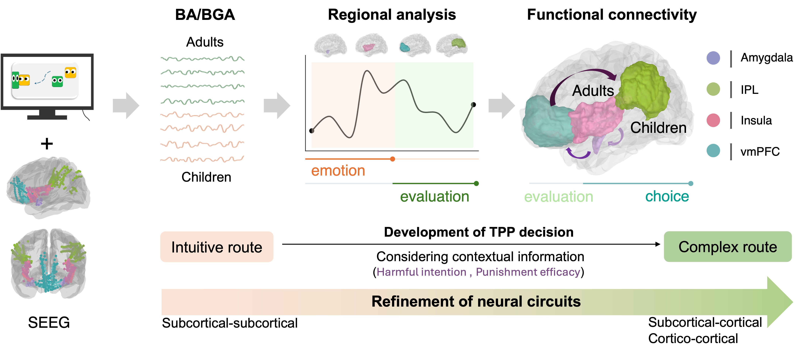

# TPP_sEEG

> From [Affective, Neuroscience, and Decision-making Lab](https://andlab-um.com)

## Highlights

* Inferred intention and punishment efficacy significantly influenced third-party punishment (TPP) decision-making in adults but not in children, highlighting developmental shift from intuitive to analytical route.
  
* Activities in the amygdala, insula, and ventromedial prefrontal cortex (vmPFC) encode the inferred intentions during TPP with distinct activation patterns between adults and children.
  
* vmPFC and inferior parietal lobule (IPL) were associated with the integration of punishment efficacy into decision making in adults. Although similar neural activation was found in children, punishment efficacy is not a significant contributor to their decisions.
  
* Adults rely more on subcortical-cortical (amygdala to vmPFC) and cortico-cortical (IPL to vmPFC) connectivity in the TPP decision, while children showes more subcortical-subcortical (insula to amygdala) connectivity duing the intuitive TPP decision.
  
* Findings support the hierarchical development model of neural circuitry, where subcortical regions maturing earlier than cortical regions. Higher levels of moral reasoning that consider more factors will be acquired through the neural refinement.
* 


## Description
* This repo mainly contains scripts for processing multimodal neurophysiological data from this project. 
* Data modality: SEEG 
* Paradigm: computer-based TPP behavioral task

##  package required:
> Python 3.9

```bash
mne
numpy
scipy
pandas
nibabel
matplotlib
pickle
```
